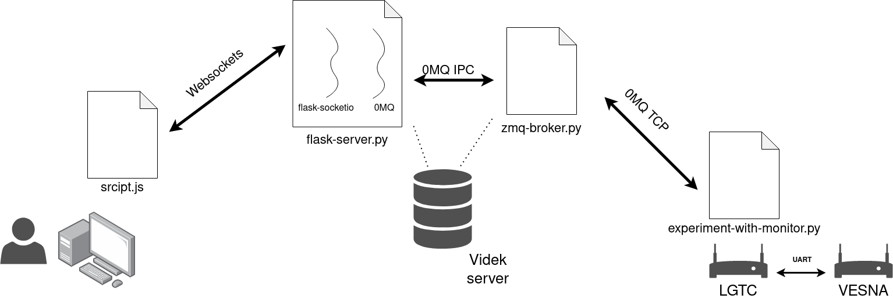

# Opis

Struktura:

* experiment-with-monitor.py --> skripta za LGTC naprave v testbedu, komunikacija z VESNO.
* zmq-broker.py --> posrednik ZMQ sporocil med Flask serverjem in LGTC napravami.
* flask-server.py --> postavi Flask server in posreduje ukaze od uporabnika do posrednika.
* static/script.js --> JavaScript z knjiznico SocketIO, prejema ukaze od uporabnika.

V mapi "lib" se nahajajo nekateri Python moduli ki sem jih spisal sam, "statics" in "templates" sta za Flask streznik. Mape "backup" in "tests" so tu samo zacasno.

## script.js

Preprost frontend - potrebuje se par ur dela.

## flask-server.py

V glavni niti (threadu) skripta komunicira z uporabnikom preko "websockets". V drugi niti pa skripta komunicira z brokerjem preko 0MQ med procesne (inter-process) komunikacije.
Med seboj si niti izmenjujeta samo eno globalno spremenljivko --> sporocilo *message_to_send*.
Multithread rabim predvsem zato, da lahko dinamicno spreminjam spletno stran; torej, da ko se nekaj zgodi na strezniku, ta samodejno posreduje sporocilo na browser. Ne pa da caka na njegov "pooling".

Skripta naj bi se izvajala v SMS containerju (Sensor Management System) ves cas. Ko se eksperiment zacne, se flask-server poveze z zmq-brokerjem.

## zmq-broker.py

Preprosto posreduje sporocila iz streznika do naprav in nazaj. Zraven ima pa se nekaj funkcionalnosti:

* Na zacetku caka da se vse naprave sinhnorizirajo, torej da LGTC-ji posljejo sporocilo brokerju, da so se uspesno zagnali - to je dobro zaradi PUB/SUB socketov...(kasneje bom verjetno to umaknil)
* Sporocila lahko poslje vsem napravam na enkrat preko PUBLISH/SUBSCRIBE socket-ov (multicast)
* Ali pa "unicast" sporocila samo eni izmed naprav preko ROUTER/DEALER socket-ov
* TODO: "heartbeat" - ko bo apk na casu (ni sporocil za izmenjevanje) lahko preverja stanje naprav in experimenta v testbedu
* TODO: posodablja eno bazo podatkov - seznam vseh aktivnih naprav in stanje eksperimentov (se izvaja, stoji, koncan,...)

Skripta se bi zacela izvajat ob zacetku eksperimenta. Lahko v SMS containerju ali morda se raje v novem containerju na Videk serverju.

## experiment-with-monitor.py

Skripta za zagon experimenta na VESNI in nadzor nad aplikacijo:

* Takoj na zacetku se sinhronizira z broker-jem.
* Nato pripravi vse za experiment (scompila in zaflesha apk, vspostavi povezavo z VESNO prek UART-a)
* V glavni *while* zanki pa shranjuje vse kar pride iz VESNE prek serijske povezave v .txt datoteko in hkrati posreduje sporocila iz brokerja na VESNO.
* Prejete odgovore iz VESNE pa posreduje nazaj do broker skripte.

 Za emulacijo LGTC-ja na PC je tu skripta /tests/lgtc-emu.py.

 
 

## TODO

Kam postavit databse (seznam naprav in stanje njihovih eksperimentov)? Urejal naj bi ga zmq-broker, uporabljal pa flask-server...ce sta vsak v svojem containerju, zna bit to problem?
